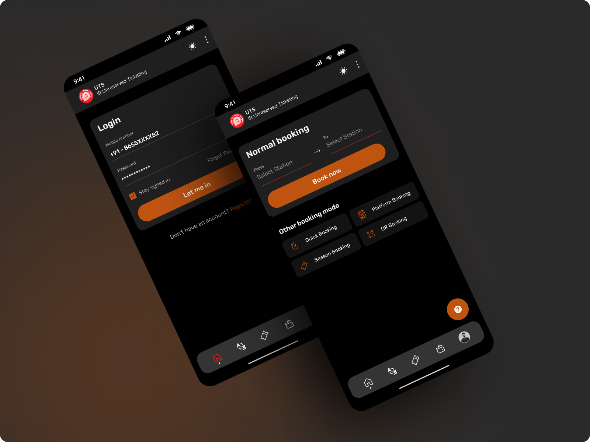

# Better UTS App Clone

UTS is an incredible app provided by the Indian government that allows users to book local train tickets with ease and convenience, without having to endure long queues at the booking counter. While the app has proven to be incredibly useful, the user interface design could be improved. As a passionate developer, I have taken it upon myself to create a stunning and user-friendly interface for the UTS app, to make booking train tickets an even more enjoyable and hassle-free experience for users.

## Screenshots

## Installation

1. Download [Expo](https://play.google.com/store/apps/details?id=host.exp.exponent&hl=en_US&gl=US) from the Google Play Store.
2. Clone the project repository from [GitHub](https://github.com/your-project-repository).
3. Navigate to the project directory in the terminal and run `yarn` to install the project dependencies.
4. Run `npm start` to start the development server.
5. Open the Expo app on your Android device and scan the QR code from the terminal.

## Usage
Using the UTS app is incredibly simple and convenient. Here are the basic steps:

1. **Login**: Log in to the UTS app using your registered mobile number and password.
2. **Select Stations**: Select your source and destination stations from the list of available stations. You can also select your preferred train type, class, and quota.
3. **Select More About Journey**: Choose your preferred journey date and time, and select any additional options, such as return tickets or platform tickets.
4. **Know About Fare**: The app will then display the fare for your selected journey, including any discounts or concessions that may apply.
Pay It: Finally, you can pay for your ticket using your preferred payment method, such as a debit card, credit card, or e-wallet.

And that's it! With the UTS app, you can book your train tickets from the comfort of your own home, and avoid the hassle of long queues and ticket counters.

## Dependencies
- Navigation using **React Navigation**
- Bottom tab bar using **@react-navigation/bottom-tabs**
- Native stack navigator using **@react-navigation/native-stack**
- Custom UI components using react-native-elements **@rneui**
- Vector icons using **react-native-vector-icons** and **@expo/vector-icons**

## Android Download Link

To download the Android APK for this project, click [here](https://expo.dev/artifacts/eas/n2vJYRL3EJMrTtEujA6syp.apk).

